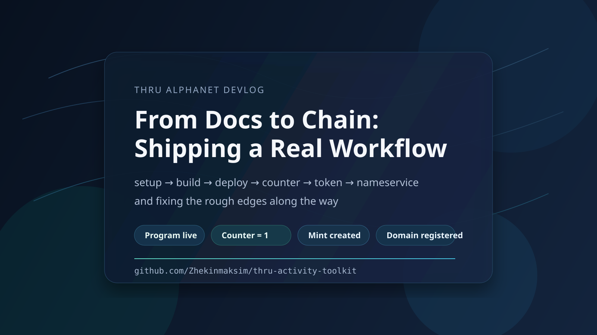
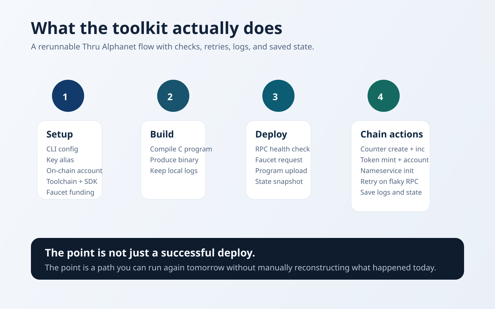
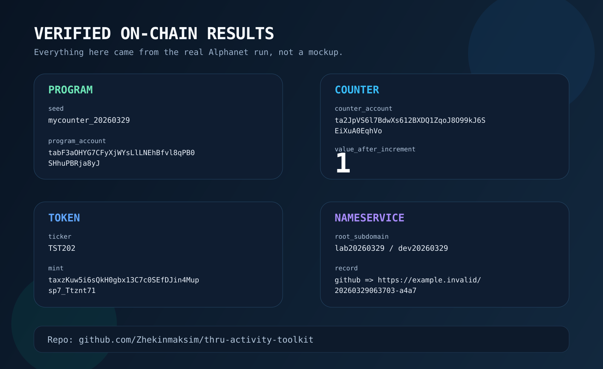
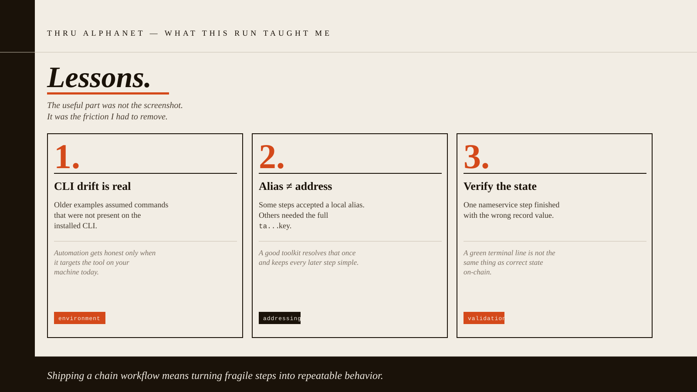

# From Setup to Chain: A Real Thru Alphanet Run

Most chain demos look clean because they end where the friction starts.

You get a screenshot, a couple of commands, and a repo that nobody wants to rerun a week later.

I wanted the opposite.

So I took Thru Alphanet from a fresh local setup all the way to real on-chain state, fixed the rough edges I hit on the way, and turned the whole thing into a small toolkit I can actually use again.

The flow I ended up shipping was simple enough to explain and annoying enough to matter:

- set up the CLI and SDK
- build a C program
- deploy it
- create counter state
- increment that state on-chain
- initialize a token mint and token account
- register a nameservice entry

Repository:
[https://github.com/Zhekinmaksim/thru-activity-toolkit](https://github.com/Zhekinmaksim/thru-activity-toolkit)

## Why I Turned It Into a Toolkit

I did not want a one-off terminal transcript.

I wanted a repo that could survive a second run without me re-learning the whole system from scratch.

That shaped the project more than the demo itself. The goal became:

- one local account
- clean setup
- health checks before network actions
- retries for flaky steps
- saved logs and state after each run
- proxy checks for connectivity, but not disguised account activity

That is what the repo is now.

## Where the Real Work Started

The official docs were a good starting point, but the useful part of the session was where documentation met actual tooling.

That is where the paper cuts showed up.

### The CLI surface had drifted

Some older examples still point to commands that do not exist on the installed CLI version. The quickest example was `keys show`.

It was not there.

The available flow was built around `list`, `get`, `generate`, `add`, and `rm`, so the scripts had to be written against the CLI that was actually on the machine, not the one I hoped was there.

### Alias and address were not interchangeable

This is the sort of detail that sounds small until it breaks a run.

For a few token and nameservice steps, a local alias like `default` was not enough. The CLI wanted a real `ta...` address.

Once that was clear, the fix was obvious: resolve the alias once, save the public key, and feed the right form into the commands that need it.

### A failed setup step was not actually a failed setup

On a repeated run, `account create` returned a nonce error.

That could have been treated as a dead stop, but the account already existed on-chain and was usable. The correct move was to verify state and continue, not blindly trust the first red line in the terminal.

### Success output still needed verification

The nameservice flow gave me a good reminder here.

One record was created with the wrong templated value because of a bug in my own defaults. The command completed, but the state was wrong. I fixed the template and then corrected the record on-chain.

That was a good checkpoint for the whole repo: command success is not the same thing as correct state.

## What Landed On-Chain

This part is real. No placeholders. No mock data.

### Program

- Seed: `mycounter_20260329`
- Program account: `tabF3aOHYG7CFyXjWYsLlLNEhBfvl8qPB0SHhuPBRja8yJ`
- Meta account: `tamgZDkWAXpQNgJbg00RslpD0IHZYmVZDZWKQ2CYRSa9nq`

### Counter

- Counter account: `ta2JpVS6l7BdwXs612BXDQ1ZqoJ8O99kJ6SEiXuA0EqhVo`
- Counter value after increment: `1`

### Token

- Ticker: `TST202`
- Mint: `taxzKuw5i6sQkH0gbx13C7c0SEfDJin4Mupsp7_Ttznt71`
- Token account: `taHgtGNt2NWkPnsm74lLJsJnCatlB9YYE2Yoy5a8sSlK1Y`

### Nameservice

- Root registrar: `lab20260329`
- Subdomain: `dev20260329`
- Domain account: `taih_vT8HFiMqN9HbKqygeErG1knk1ewDut-hOOF3JBWdJ`
- Record:
  `github => https://example.invalid/20260329063703-a4a7`

## What I Actually Like About This Result

The deployed addresses are useful, but the better outcome is the path that produced them.

The repo now keeps:

- per-step logs
- current state snapshots
- run history
- retry behavior
- RPC health checks
- resume support for repeated runs

That may not be the flashy part, but it is the part that turns a testnet session into a repeatable developer workflow.

## Final Take

I like this kind of work because it removes pretending from the process.

Instead of saying the docs "seem fine," you run the flow, hit the edges, fix what broke, and leave behind something sharper than what you started with.

That is what this repo is meant to be: a practical single-account Thru Alphanet toolkit with real chain state behind it.

If you are building on Thru and want a starting point for setup, deployment, counters, tokens, nameservice, and RPC or proxy checks, the repo is here:

[https://github.com/Zhekinmaksim/thru-activity-toolkit](https://github.com/Zhekinmaksim/thru-activity-toolkit)
